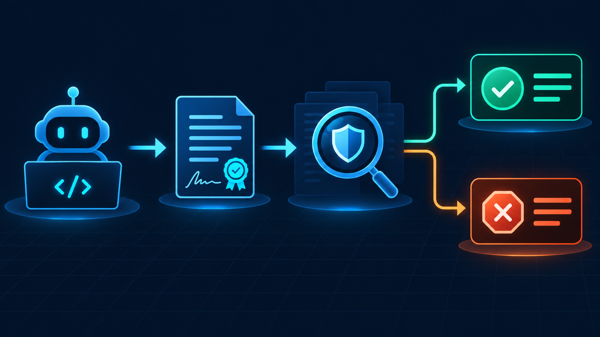

# Shokunin Benchmarks

[](docs/METHODOLOGY.md)
[](https://www.harborframework.com/)
[](package.json)
[](package.json)


An evidence-first benchmark for a simple question: **can an autonomous coding agent
complete the task without violating the task’s completion contract?**

### What is Shokunin?

Shokunin is a governance layer for AI-assisted software engineering. It gives coding
agents bounded lifecycle zones, explicit responsibilities, deterministic gates,
durable state, and auditable release proofs. The goal is to solve the recurring gap
between a plausible-looking diff and software that is actually verified: stale
context, scope drift, premature “done” claims, weak tests, multi-agent collisions,
and missing accountability.

Read the [one-page Shokunin overview](docs/SHOKUNIN_OVERVIEW.md) for the model and
the public vocabulary used by this benchmark.

Shokunin Benchmarks evaluates governance mechanisms against externally verified,
isolated agent tasks. It records the difference between a task that appears complete
and one that is actually accepted by an independent verifier. The benchmark repository
is intentionally separate from `shokunin-harness`: it owns the experiment contracts,
calibration, evidence model, tests, and lifecycle controls.

## What is being measured

The benchmark tests one concrete Shokunin claim:

> **`DECLARED DONE` is not the same as `VERIFIED DONE`.**

An agent may say that a task is finished. Shokunin’s promise is that this claim is
not accepted as success until an independent verifier checks the required behavior
and the evidence is available. The benchmark measures whether that distinction is
actually enforced in practice: does the system reject a convincing but incomplete
completion, while accepting a completion that satisfies the contract?

The H1 pilot compares four controlled operating modes (A0–A3) across the same task
corpus. Each trial is classified from verifier evidence as `PASS`, `FAIL`, or
`BLOCKED` when the required tooling/evidence is unavailable. The public result is an
aggregate research artifact—not a claim that any single model, prompt, or run is
universally superior.



The visual summary is deliberately simple: an agent’s completion claim is an input,
not a verdict. H1 observes whether independent evidence turns it into an accepted
completion or stops it as an incorrect or unverifiable claim.

The current pilot is still running. Results will be published only after the run is
sealed, the manifest is checked, and the aggregate report has passed the repository’s
publication review.

## Public evidence boundary

This repository publishes methodology, contracts, tests, manifests, aggregate
statistics, and explicitly redacted examples. Raw agent transcripts, workspace
snapshots, container exports, credentials, and private Shokunin implementation
snapshots are excluded by policy and by `.gitignore`. A snapshot is publishable only
when it has been reviewed for secrets, local paths, prompts, and commercial source.

## Reproduce the checks

```bash
pnpm install --frozen-lockfile
pnpm test
pnpm hooks:materialize:check
```

The repository also runs these checks automatically on GitHub pull requests. The
public-boundary workflow rejects private snapshots, credentials, and unreviewed
execution traces before they can be merged.

Read [`AGENTS.md`](AGENTS.md), [`MEMORY.md`](MEMORY.md), and
[`docs/METHODOLOGY.md`](docs/METHODOLOGY.md) before changing the experiment.

## Research notes

- [`docs/METHODOLOGY.md`](docs/METHODOLOGY.md) — design, controls, and interpretation
- [`docs/HYPOTHESES.md`](docs/HYPOTHESES.md) — hypotheses under test
- [`docs/THREATS_TO_VALIDITY.md`](docs/THREATS_TO_VALIDITY.md) — known limitations
- [`MEMORY.md`](MEMORY.md) — sealed decisions and run journal

## Publication line

> Reliable agent completion is not a feeling. It is a claim backed by an independent
> verifier, an auditable evidence trail, and a clearly stated boundary around what was
> measured.

## Status

This is an active pilot, not a finished leaderboard. Contributions that improve
reproducibility, calibration, evidence quality, or publication safety are welcome.
